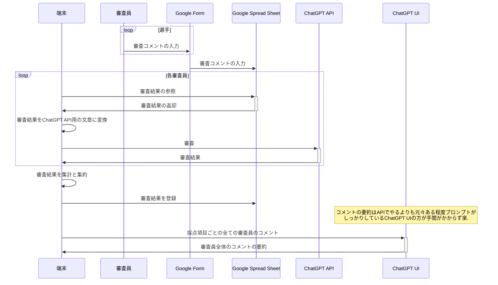

# judge_gpt

## 概要
ChatGPTを初めとしたLLMを利用して審査コメントを点数化するシステム.  
各選手の演技に対するコメントをもとに、評価基準に則り点数化する。

## 環境構築

1. ryeのinstall [参考](https://rye-up.com/guide/installation/)
2. `rye sync`の実行

## 審査システムの概要

審査コメントをGoogle Formで入力し、Spread SheetでPythonから読み込みChatGPT APIを利用する.

## 設定
事前準備として以下の2点が必要

- PythonからGoogle Spread Sheetを利用するためにGCPにプロジェクトを作成する
- PythonからGPTを利用するためにOpenAIのAPI利用登録

### ファイルについて
審査実施のために必要なファイル

| ファイル名 | 説明 |
| :--- | :--- |
| `judge.yaml` | 審査について必要な情報を記載する |
| `response_schema.yaml` | ChatGPTのfunction Callingのためのスキーマを設定する |

#### judge.yaml

主項目
- gss: Google Spread Sheetに関する設定を記載
- chatgpt: ChatGPTに関する設定を記載

##### gss
| ファイル名 | 説明 |
| :--- | :--- |
| `gcloud` | gssをpythonで取得するために必要なgcloudの認証key |
| `gss_key` | google spread sheetの識別子. URLに含まれるランダムそうな文字列 |
| `output` | 審査結果を出力するスプレッドシートの識別子

##### chatgpt
| ファイル名 | 説明 |
| :--- | :--- |
| `secrets`| openai API接続のためのKey |
| `model` | 利用するGPTモデル |
| `seed` | chatgptの出力を生成するためのseed値
| `prompt_judge` | 審査についての説明用プロンプト |
| `prompt_summarize`| 審査元のコメントを要約するためのプロンプト |

#### `response_schema.yaml`
function callingの設定は[json schema](https://json-schema.org/learn/getting-started-step-by-step)を利用している.  
なので、基本的にはjson schemaを基にしつつフィールドの説明としてdescriptionを設定すればいい.  

独自のpromptでjsonを返却させることもできそうだけど、安定性と簡単のためにfunction callingを利用する.

各審査員ごとの結果を辞書として受け取り、それらを配列として出力させるようにする.

